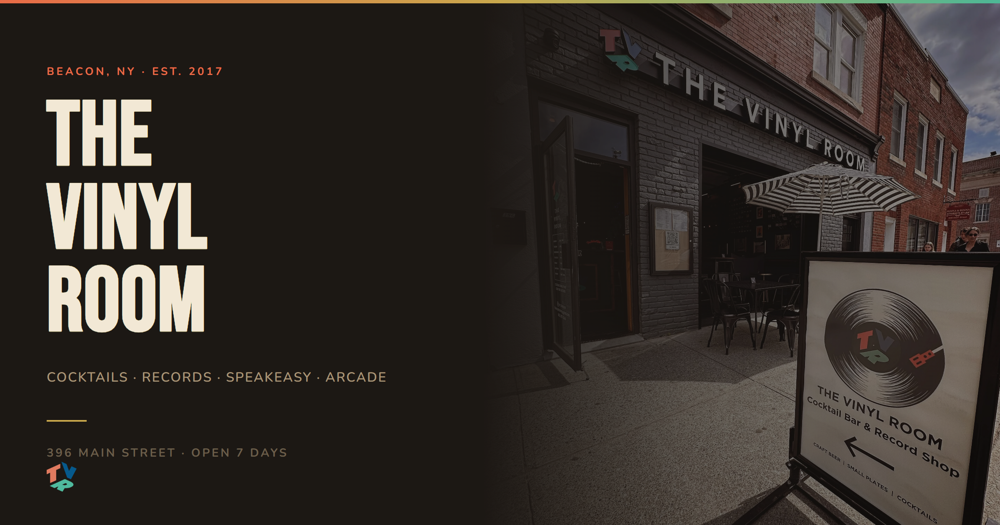

# The Vinyl Room

**[Live Site →](https://thevinylroomny.netlify.app/)**

Website for The Vinyl Room — a cocktail bar, record shop, lounge, and vintage arcade on Main Street in Beacon, NY. DJs every Friday and Saturday.

## Stack

HTML5 · CSS3 · JavaScript (vanilla) · Bebas Neue + Nunito (Google Fonts)

## Pages

| File | Description |
|------|-------------|
| `index.html` | Homepage |
| `menu.html` | Drinks and food menu |
| `events.html` | Upcoming events and DJ nights |
| `record-shop.html` | Record shop |
| `arcade.html` | Vintage arcade |
| `contact.html` | Contact and hours |
| `admin.html` | Admin page |
| `brand-identity.html` | Brand style guide |

## Running it

Open `index.html` in a browser. No build step.

## CSS architecture

Shared tokens, reset, nav, footer, and animations in `styles.css`.
Page-specific styles in a `<style>` block per page.

Dark background with coral/orange accent color system via CSS custom properties. Accent colors: `--c-accent` (coral orange) and `--c-navy`.

## JavaScript (`main.js`)

Shared across all pages:

- Nav gets `is-scrolled` class after 40px of scroll
- Smooth scrolling for anchor links
- `IntersectionObserver` reveal for `.reveal` elements

**Needle Drop mobile nav** — the signature interaction: a record-shaped button spins up, the screen goes dark, a coral scan line drops from top to bottom, and nav links materialize as the line passes each one. Active page is auto-detected and highlighted via `window.location.pathname`.
